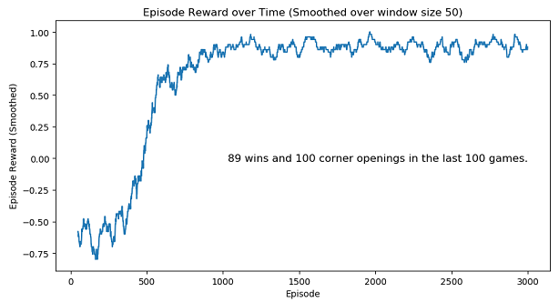

# Tic-Tac-Toe Reinforcement Learning with Q-Learning and SARSA

## Goal
Using reinforcement learning (Q-learning and SARSA) to see if an AI agent can learn playing a fork (two non-blocked lines of two) in tic-tac-toe.

Example of forks:


Note this program is not a game a user can play interacting with UI.

---
## How this works
An AI agent plays tic-tac-toe against an algorithm player many times. In order to win, the AI agent always opens a game. The algorithm player is not an AI. It has only two simple strategies; win if it has two marks inline; block if the AI agent has two marks inline. It plays randomly for the rest. The only way for the AI agent to win a game is to play a fork.

Each execution of the program runs a certain number of episodes (games). After each episode the AI agent will receive a reward value; 1 if it wins; 0 if the game is tied; -1 if it loses. At the end of an execution, it will display a graph that shows relationship between episodes and rewards. For better visualization, the graph is smoothed over a window of size 50.


---
## How to run
This is a python 3 program. Execute tictactoe_main.py. To install the required packages, requirements.txt is included, so simply run the following command.
```
    pip install -r requirements.txt
```

To switch between Q-Learning and SARSA, in the main function in tictactoe_main.py, you will find these two sets of two lines.
```python
    agent = TicTacToeQLearningAgent()
    # agent = TicTacToeSarsaAgent()

    experiment = QLearningExperiment(env, agent, before_episode_callback, after_episode_callback)
    # experiment = SarsaExperiment(env, agent, before_episode_callback, after_episode_callback)
```
Comment out whichever you don't want.

---
## Folder hierarchy
* **the root folder**: contains python script files with the tic-tac-toe specific code.
* **readme_images**: contains images for this README file.
* **rl_base**: contains python script files with reinforcement learning code. These files do not have any tic-tac-toe related code. They can be reused for other reinforcement learning programs.
* **tests**: contains unit test files with pytest.

---
## Analysis
The graph displayed after each execution shows that the AI agent successfully found ways to play forks and converges after about 1,500 episodes. After the convergence the AI agent can consistently beat the algorithm player 8 or 9 times out of 10 games.

If you run the program multiple times, you will see two different results in the last 100 games. In some executions the AI agent picks a corner for the opening move all 100 times in the last 100 games. For the rest, it doesn't pick corners for the opening move at all (it picks the center for all 100 times).




You may notice that when the AI agent opens games with a corner, it has more wins. Why? If the AI agent opens a game with a corner, the algorithm player has only 1 / 12 (8.33%) chance of tying the game. If the center is the opening move, the chance of tying the game increases to 1 / 6 (16.67%). In other words, opening a game with a corner gives the AI agent higher chance (11 / 12 or 91.67%) of winning the game than opening with the center (5 / 6 or 83.33%). Let's demonstrate them. Remember the algorithm player knows simple defensive moves and assume that the AI agent is already smart enough.

If a game opens with a corner, the algorithm player must pick the center (1 out of 8 open spaces) to be able to square the game. The best next move for the AI agent is the diagonally opposite corner. And then, for the algorithm player to successfully defend, it must pick one of the four edges (side middles) (4 out of 6 open spaces) instead of a corner. This move forces the AI agent to defend itself. Otherwise, the AI agent will get a fork. The chance will be calculated as 1 / 8 * 4 / 6 = 1 / 12.


If a game opens with the center, the only way that keeps the algorithm player from losing is playing a corner (4 out of 8 open spaces). The best next move for the AI agent is playing the diagonally opposite corner of the algorithm player's mark. Now for the algorithm player to prevent the AI agent from playing a fork, it must take one of the two corners left (2 out of 6 open spaces). The rest will be autopilot. The chance will be calculated as 4 / 8 * 2 / 6 = 1 / 6.


Then, why does the AI agent sometimes keep playing the center? It didn't explore enough to discover the best opening move. The epsilon value decayed too quickly. There is room to tune the program.
